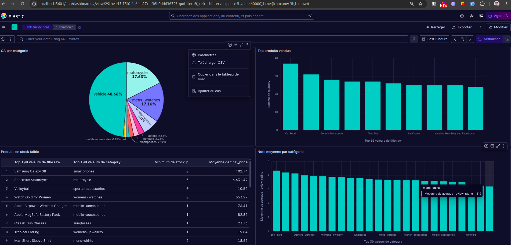
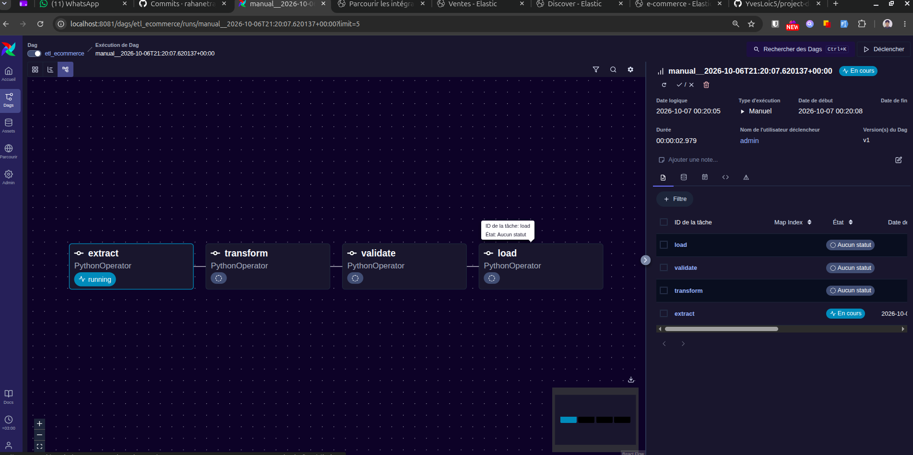
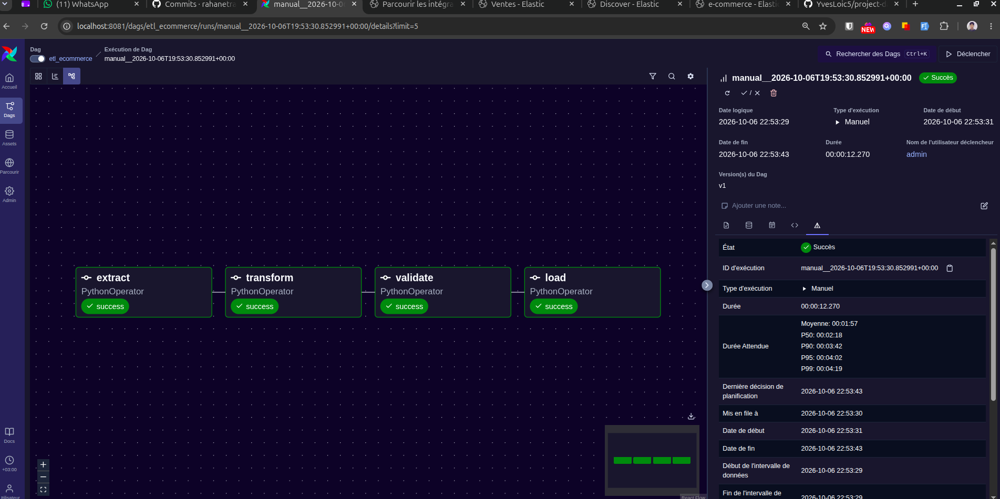

# Pipeline ETL e-commerce : Airflow, Elasticsearch et Kibana

Projet final de Data Engineering. Il collecte des données de produits et de commandes depuis une API publique, les transforme, contrôle leur qualité, les charge dans Elasticsearch et les analyse dans un tableau de bord Kibana.

## Sommaire

- [Contexte](#contexte)
- [Architecture](#architecture)
- [Sources de données](#sources-de-données)
- [Transformations](#transformations)
- [Contrôles qualité](#contrôles-qualité)
- [Mapping Elasticsearch](#mapping-elasticsearch)
- [Analyses](#analyses)
- [Tableau de bord Kibana](#tableau-de-bord-kibana)
- [Lancer le projet](#lancer-le-projet)
- [Structure du dépôt](#structure-du-dépôt)
- [Difficultés rencontrées](#difficultés-rencontrées)
- [Démonstration](#démonstration)

## Contexte

Une boutique en ligne veut suivre ses ventes, ses stocks et la satisfaction de ses clients. Les données existent, mais elles sont brutes : des champs manquent, des dates ont des formats différents, et les lignes de commande ne sont pas reliées aux produits.

Ce projet montre le parcours complet d'une donnée :

**Collecter → Transformer → Contrôler → Charger → Analyser → Visualiser**

## Architecture

```
API DummyJSON → Airflow (Extract → Transform → Validate → Load) → Elasticsearch → Kibana
```

Airflow orchestre quatre tâches enchaînées. Elasticsearch stocke les données, Kibana les affiche. Tout tourne en local avec Docker Compose.

| Service       | Rôle                                  | Adresse                |
|---------------|---------------------------------------|------------------------|
| Airflow       | Orchestration du DAG `etl_ecommerce`  | http://localhost:8081  |
| Elasticsearch | Stockage et recherche                 | http://localhost:9200  |
| Kibana        | Visualisation                         | http://localhost:5601  |
| PostgreSQL    | Base interne d'Airflow                | (interne)              |

## Sources de données

Source : **[DummyJSON](https://dummyjson.com)**, une API publique sans clé d'accès.

- `/products` : 194 produits avec prix, remise, stock, catégorie, marque, note et avis clients.
- `/carts` : 208 paniers, soit 800 lignes de vente au total.

Les données brutes sont téléchargées à chaque exécution dans `data/raw/`. Ce dossier et `data/processed/` ne sont pas versionnés : le pipeline les recrée.

## Transformations

Le script `scripts/transform.py` applique les transformations suivantes :

1. **Suppression des doublons** sur `id` (produits et paniers).
2. **Gestion des valeurs manquantes** : la marque absente d'un produit est remplacée par « Inconnue » (92 produits concernés).
3. **Normalisation des dates** : les dates des avis, au format ISO avec millisecondes, sont converties en `AAAA-MM-JJ`.
4. **Conversion de types et arrondis** : prix et notes en nombres décimaux à deux chiffres après la virgule.
5. **Création de nouvelles colonnes** :
   - `final_price` : prix après remise ;
   - `stock_value` : valeur du stock (prix après remise × stock) ;
   - `average_review_rating` : note moyenne des avis d'un produit ;
   - `line_total` : montant d'une ligne de vente (prix unitaire × quantité).
6. **Jointure** : chaque ligne de panier est reliée à son produit pour récupérer la catégorie, la marque et le prix.

Les produits sont enregistrés dans `data/processed/products.json`, les ventes dans `data/processed/sales.json`.

## Contrôles qualité

Le script `scripts/validate.py` effectue 12 contrôles. Si l'un d'eux échoue, la tâche échoue et Airflow la relance.

**Produits**
- le catalogue n'est pas vide ;
- les champs obligatoires sont renseignés ;
- `product_id` est unique ;
- les prix sont positifs ;
- les stocks sont positifs ;
- les remises sont comprises entre 0 et 100 % ;
- les dates d'avis ne sont pas dans le futur.

**Ventes**
- les ventes ne sont pas vides ;
- chaque vente correspond à un produit du catalogue ;
- `line_id` est unique ;
- les quantités sont strictement positives ;
- le total de chaque ligne égale prix unitaire × quantité.

## Mapping Elasticsearch

Le mapping est défini dans `elasticsearch/mapping.json`. Chaque champ a un type explicite pour que Kibana l'interprète correctement :

- `price`, `final_price`, `line_total` : `float` ;
- `stock`, `quantity`, `review_count` : `integer` ;
- `category`, `brand`, `sku` : `keyword`, pour les agrégations et les filtres exacts ;
- `title` : `text` avec un sous-champ `title.raw` en `keyword`, pour la recherche plein texte et les regroupements ;
- `reviews.date` : `date` au format `yyyy-MM-dd`.

Deux index sont créés :
- `products` : 194 documents, un par produit ;
- `sales` : 800 documents, un par ligne de vente.

Le chargement utilise l'identifiant du document comme `_id` (`product_id` pour les produits, `line_id` pour les ventes). Relancer le pipeline met donc à jour les documents au lieu de les dupliquer.

## Analyses

Les requêtes sont dans `elasticsearch/queries.json`. Chacune répond à une question concrète :

| Requête | Question |
|---------|----------|
| `chiffre_affaires_par_categorie` | Quelles catégories rapportent le plus ? |
| `top_produits_vendus` | Quels sont les 10 produits vendus en plus grande quantité ? |
| `prix_moyen_ligne_par_marque` | Quel est le montant moyen d'une ligne de vente selon la marque ? |
| `note_moyenne_par_categorie` | Quelles catégories sont les mieux notées ? |
| `produits_stock_faible` | Quels produits risquent la rupture (stock inférieur à 10) ? |
| `valeur_stock_par_categorie` | Quelle est la valeur immobilisée en stock par catégorie ? |

Quelques résultats observés lors de l'exécution :
- la catégorie `vehicle` concentre le plus gros chiffre d'affaires, avec environ 1,68 M€ ;
- les ventes sont très dispersées : les 10 produits les plus vendus totalisent 275 unités sur 2 417, et le reste est réparti sur 188 produits distincts. Le produit en tête est « Cat Food » (37 unités) ;
- plusieurs produits sont en rupture de stock (stock à 0).

## Tableau de bord Kibana

Le tableau de bord « e-commerce » contient quatre visualisations :

1. **CA par catégorie** : camembert de la somme de `line_total` par catégorie (top 10), pour voir la part de chaque catégorie dans le chiffre d'affaires.
2. **Top produits vendus** : somme des quantités par produit (top 10).
3. **Produits en stock faible** : tableau des produits dont le stock est inférieur à 10, trié par stock croissant.
4. **Note moyenne par catégorie** : moyenne des notes par catégorie (top 30).

Deux vues de données (`sales` et `products`) alimentent ces visualisations. Le fichier `kibana/dashboard.ndjson` contient l'export complet.



## Lancer le projet

### Prérequis

- Docker et Docker Compose ;
- environ 4 Go de mémoire disponible pour les conteneurs ;
- accès à Internet pour récupérer les images et les données.

### Étapes

1. Cloner le dépôt :
   ```bash
   git clone git@github.com:rahanetraj/projet-data-engineering-ecommerce.git
   cd projet-data-engineering-ecommerce
   ```

2. Lancer la stack :
   ```bash
   docker compose up -d
   docker compose ps
   ```
   Attendre que les services soient `healthy`. Le premier démarrage peut prendre plusieurs minutes, le temps de télécharger les images.

3. Récupérer le mot de passe admin d'Airflow. Il est généré à chaque création du conteneur :
   ```bash
   docker compose logs airflow | grep -i password
   ```

4. Ouvrir Airflow sur http://localhost:8081, se connecter avec `admin` et le mot de passe trouvé, activer le DAG `etl_ecommerce` puis cliquer sur **Déclencher**. Les quatre tâches (`extract`, `transform`, `validate`, `load`) doivent passer au vert.

5. Vérifier les données dans Elasticsearch :
   ```bash
   curl "http://localhost:9200/_cat/indices?v"
   curl "http://localhost:9200/sales/_count"    # 800
   curl "http://localhost:9200/products/_count" # 194
   ```

6. Importer le tableau de bord dans Kibana (http://localhost:5601) : menu **Gestion de la Suite** → **Objets enregistrés** → **Importer**, puis sélectionner `kibana/dashboard.ndjson`.

7. Arrêter la stack :
   ```bash
   docker compose down
   ```
   Ajouter `-v` supprime aussi les données Elasticsearch et Postgres.

### Exécution hors Docker

Les scripts peuvent aussi être lancés seuls, avec Python 3.12 et les dépendances de `requirements.txt` :

```bash
pip install -r requirements.txt
python3 scripts/extract.py
python3 scripts/transform.py
python3 scripts/validate.py
```

Le chargement vers Elasticsearch (`scripts/load.py`) attend une instance accessible sur `http://localhost:9200`.

## Structure du dépôt

```
projet-data-engineering/
├── dags/
│   └── etl_pipeline.py        # DAG Airflow : extract → transform → validate → load
├── scripts/
│   ├── extract.py             # Récupération paginée depuis DummyJSON
│   ├── transform.py           # Nettoyage, enrichissement et jointure
│   ├── validate.py            # 12 contrôles qualité
│   └── load.py                # Création des index et chargement idempotent
├── elasticsearch/
│   ├── mapping.json           # Mapping des index products et sales
│   └── queries.json           # Six requêtes d'analyse
├── kibana/
│   └── dashboard.ndjson       # Export du tableau de bord et des visualisations
├── data/                      # Généré par le pipeline (non versionné)
├── docs/screenshots/          # Captures d'écran
├── docker-compose.yml         # Airflow, Elasticsearch, Kibana, PostgreSQL
├── requirements.txt
└── README.md
```

## Configuration du DAG

- **Planification** : quotidienne (`@daily`), sans rattrapage des dates passées (`catchup=False`).
- **Relances** : 2 tentatives par tâche, espacées d'une minute.
- **XCom** : la tâche `validate` transmet ses compteurs à la tâche `load`.
- **Connexion Airflow** : `elasticsearch_default`, créée automatiquement à partir de la variable d'environnement `AIRFLOW_CONN_ELASTICSEARCH_DEFAULT` dans `docker-compose.yml`.

Pendant l'exécution, la tâche `extract` est en cours :



Une fois le run terminé, les quatre tâches sont en succès :



## Difficultés rencontrées

- **Elasticsearch bloqué par le disque** : au-delà de 90 % d'occupation, Elasticsearch n'alloue plus ses shards. La règle de seuil disque est désactivée dans le compose, ce qui convient à un usage local uniquement.
- **Doublons silencieux** : deux lignes d'un même panier pouvaient avoir le même identifiant (`cart_id-product_id`), et Elasticsearch écrasait une des deux. Les ventes passent maintenant par un `line_id` unique, et un contrôle vérifie cette unicité.
- **Permissions** : le conteneur Airflow ne pouvait pas écrire dans `data/`, créé par l'utilisateur de la machine hôte.
- **Conflit de dépendances** : figer `requests` à une version trop ancienne cassait d'autres paquets d'Airflow. La contrainte a été retirée, car `requests` est déjà fourni par l'image.

## Démonstration

Vidéo de démonstration : *à ajouter*.

Elle montre le déclenchement du DAG, les données dans Elasticsearch et le tableau de bord Kibana.
